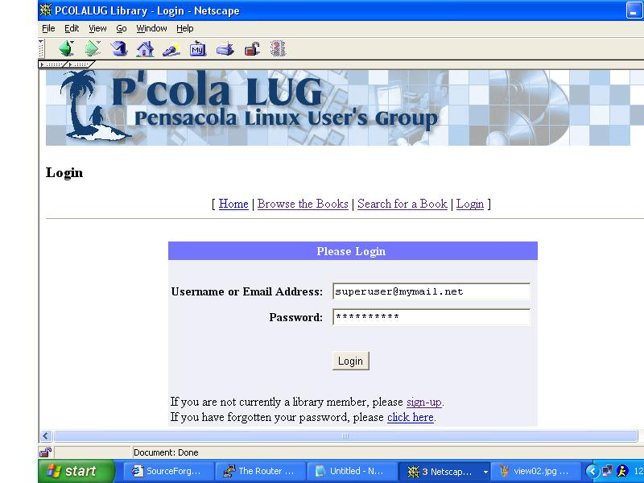
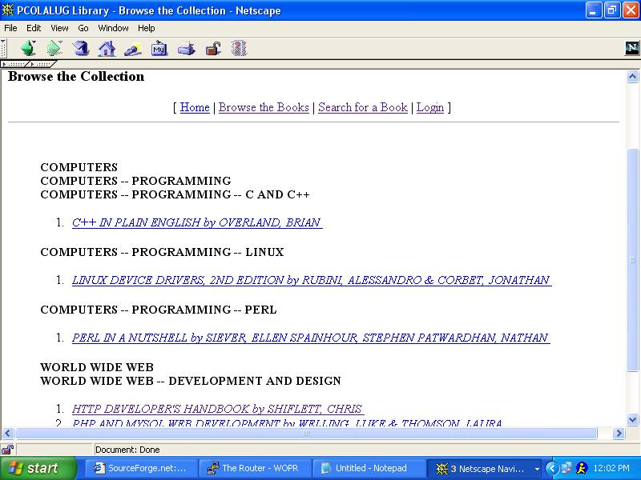
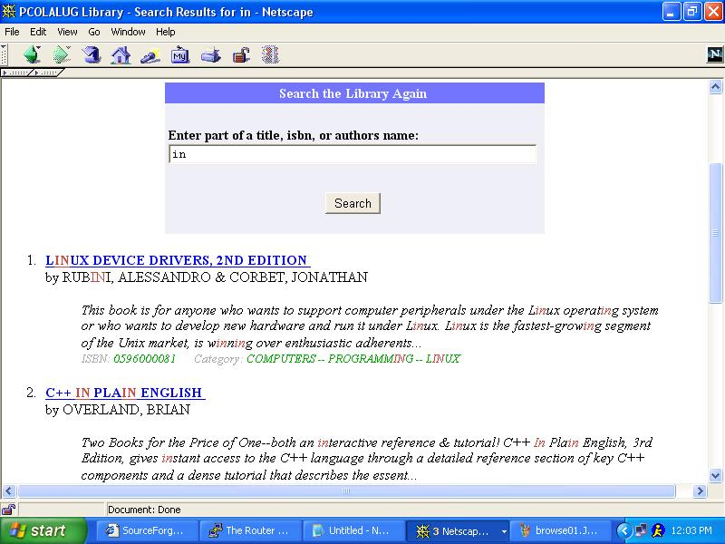
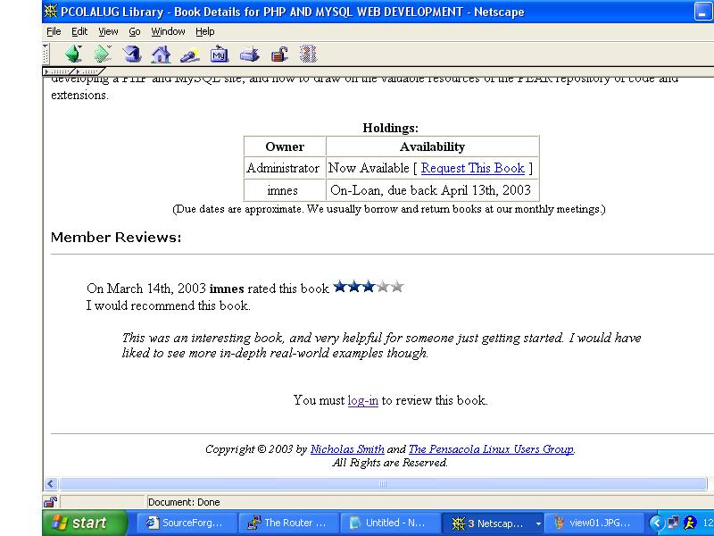
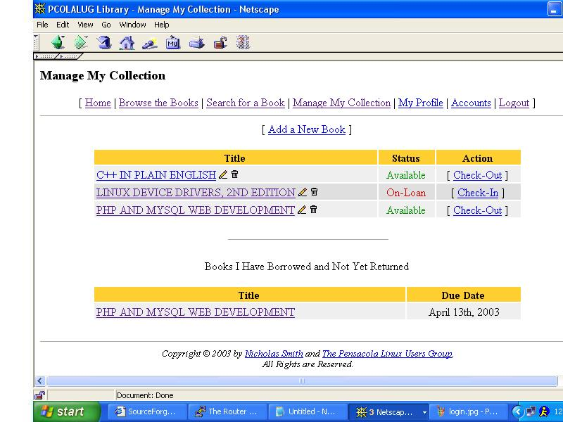
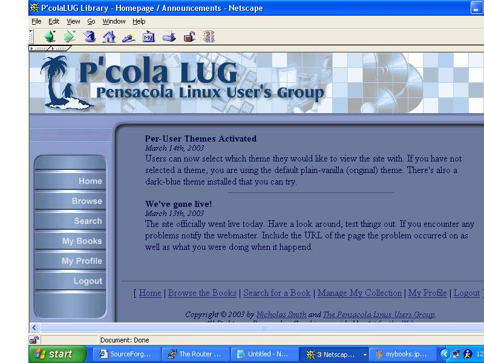

# LUG Library

A web-based library management system.

## Screenshots

Below are some screenshots of the application:

### Login


### Browse Books


### Search


### View Book Details



### My Books


### Blue Theme


## Credits

* **Nicholas Smith (imnes@go.com)** - Initial coding of complete site.

## Database

To set up the database:

1.  Make sure the account you're installing under has the appropriate permissions to create database tables.
2.  Create a database named `pluglib`.
3.  Run each `.sql` file in the `library/sql/` directory using the following command:

    ```bash
    mysql --password='yourpasswordhere' < filename.sql
    ```

4.  Update `library/include.php` with the correct database login information.

## Running the Project

To run this project, you will need a web server (like Apache) with PHP and a MySQL database.

1.  Clone or download this repository to your web server's document root.
2.  Follow the database setup instructions above.
3.  Access the project in your web browser.

## License

This project is licensed under the MIT License - see the [LICENSE](LICENSE) file for details.
